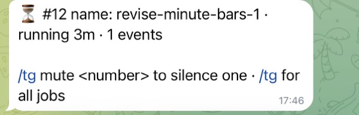
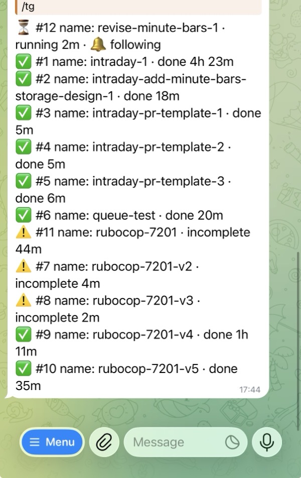
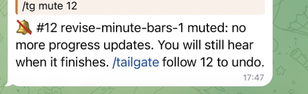

# tailgate

### Progress updates in your chat for the long jobs your [Hermes Agent](https://github.com/NousResearch/hermes-agent) hands off to coding agents, CI and scripts, without spending a single model turn.



*Hermes has handed a coding task to OpenHands as job #12, and every 5 minutes tailgate posts where
it stands (shown in Telegram).*

## The problem

You ask your agent for something big, it hands the work to a coding agent on another machine, and
then there is silence for an hour. Was it started? Is it stuck? Did it finish while you weren't
looking? Hermes can report on processes it started itself, with one global switch, but not on
jobs running somewhere else, and asking the agent to keep checking is worse: on a local model,
every check is a model turn taken away from the job it is checking on.

tailgate borrows an idea from Claude Code: while it works, its status line always tells you what
it is doing and for how long (`✳ Discombobulating… (11s · ↓ 624 tokens)`). tailgate gives the jobs
Hermes hands off the same kind of line (`running 14m · 38 events · last: bundle exec rspec`),
delivered to your chat every 5 minutes, plus one line when the job is done.

## What tailgate does

- **Progress every 5 minutes** (by default, [configurable](#quick-start)) for each running job: how long it has run, how far it got, its
  last step. One line when it finishes, and never more than one.
- **Short numbers** for every job (`#12`), so muting one from your phone is `/tg mute 12`.
- **Per-job control**: new jobs are followed, and you mute the ones you don't care about. Muted jobs still
  tell you when they finish.
- **Any chat Hermes supports**: Telegram, Discord, Slack, Signal and the rest. Updates are plain
  text, so they look the same everywhere.
- **No model calls, so no GPU time.** Updates are a script-only Hermes cron job, and the `/tg`
  commands answer directly. Following a job never takes a turn on your model, so on a local setup
  it can't slow down the job it reports on.
- **Works with anything that can list its jobs**: a coding agent's job runner, CI, a batch script.
  You give tailgate a command that prints the jobs as JSON (see [Job sources](#job-sources)).

## Contents

- [Quick start](#quick-start)
- [Use](#use)
- [The agent and `tailgate_job_id`](#the-agent-and-tailgate_job_id)
- [Job sources](#job-sources)
- [Security](#security)
- [Known issues](#known-issues)
- [Development](#development)

## Quick start

```bash
hermes plugins install https://github.com/c0mrade/tailgate    # or copy this directory to ~/.hermes/plugins/tailgate
hermes plugins enable --no-allow-tool-override tailgate
```

Tell tailgate where your jobs are (see *Job sources*), restart Hermes (`hermes-gateway` and, if
you use web chats, `hermes-dashboard`: each loads plugins once at start), then schedule the
progress round:

```bash
hermes tailgate setup --deliver telegram    # schedule defaults to "*/5 * * * *"
```

Without `--deliver`, the target is `origin`. Run from a terminal there is no originating chat, so
Hermes falls back to the home channel of the first platform that has one (set it with `/sethome`
in that chat). With no home channel anywhere, nothing is delivered and the cron job records a
delivery failure.

`setup` writes `~/.hermes/scripts/tailgate-tick.py` and creates (or updates) a no-agent cron job
named `tailgate`. Run it again after changing the schedule or target. Conversations started
before the install don't see tailgate, please start a new one.

`--schedule` takes a cron expression, default `*/5 * * * *`, so updates land on fixed clock
times (Hermes validates the expression). Hermes's scheduler checks once a minute, so a round can
start up to a minute after its time.

```bash
hermes tailgate setup --schedule "*/10 * * * *" --deliver telegram   # every 10 minutes
hermes tailgate setup --schedule "*/15 9-17 * * 1-5"                 # every 15 minutes, 9:00-17:59, weekdays
```

Turn off Hermes's default header and footer on cron deliveries, so updates look like the screenshot
above: tailgate's lines and its `/tg mute <number>` hint, nothing else.

```bash
hermes config set cron.wrap_response false     # applies to all cron jobs, Hermes has no per-job switch
```

## Use



*`/tg` in a Telegram chat with Hermes: job #12 is running and followed, the others are finished.*

| In chat | |
|---|---|
| `/tg` (or `/tailgate`) | List jobs, running first, with 🔔 following or 🔕 muted |
| `/tg mute <number>` | No more progress lines for that job, but the finish line still comes. Without a number: the only running job |
| `/tg follow <number>` | Progress lines again |




*Muting and following job #12 from Telegram. These commands answer instantly: they don't go
through the model.*

A job's number (`#12` above) is handed out the first time tailgate sees it and never reused. Names
work too, e.g. `/tg mute revise-minute-bars-1`.

| In a terminal | |
|---|---|
| `hermes tailgate status` | Sources and jobs |
| `hermes tailgate tick [--dry-run]` | Run one progress round now and print it |
| `hermes tailgate mute <number>` / `follow <number>` | Same as in chat |
| `hermes tailgate setup [--schedule "*/5 * * * *"] [--deliver target]` | Install or update the cron job |

## The agent and `tailgate_job_id`

The agent gets one tool, `tailgate_job_id(topic)`, which turns a topic into a short, never-reused
job name (at most three words), e.g. "Revise minute-bars storage design per PR #2 review" became
`revise-minute-bars-1`. tailgate adds one sentence to each new conversation's system prompt asking
the agent to use it.

The tool is optional: tailgate reports every job its sources list, whatever the agent does. The
tool only keeps names short and tidy.

## Job sources

A source is a command tailgate runs (no shell) that prints one JSON object per job, one per line,
and exits 0:

```json
{"id": "revise-minute-bars-1", "state": "running", "elapsed_s": 840, "progress": "38 events", "last": "bundle exec rspec"}
```

| Field | Required | |
|---|---|---|
| `id` | yes | `[a-z0-9][a-z0-9._-]{0,62}`, shown to the user as the job's name |
| `state` | yes | `queued`, `running`, `done`, `incomplete` or `failed` |
| `elapsed_s` | no | Seconds since the job started (or how long it ran) |
| `progress` | no | Short free text, e.g. `38 events` or `step 4/9` |
| `last` | no | Short free text, e.g. the last command |

The job's number (`#12`) is not part of a source's output. tailgate assigns it the first time it
sees a job and keeps it in its own state, so sources only have to name their jobs.

Configure sources in `~/.hermes/config.yaml`:

```yaml
plugins:
  entries:
    tailgate:
      settings:
        sources:
          - name: openhands
            command: [ssh, sandbox, openhands-remote, watch, --json]
```

or with `hermes config set plugins.entries.tailgate.settings.sources '[{"name": "openhands", "command": ["ssh", "sandbox", "openhands-remote", "watch", "--json"]}]'`.
Restart the gateway after changing sources.

`hermes tailgate setup` records the jobs that already exist as history, and they are never announced.
Every job that appears after that gets its finish line, even one that starts and ends between two
rounds. State for jobs no source has reported for two weeks is dropped.

## Security

`progress` and `last` come from wherever the job runs, which may be a machine running untrusted
code. tailgate only ever shows them to you: they never enter the model's context (keep Hermes's
`cron.mirror_delivery` off, the default), control characters are stripped and length is capped.
Sources are argv lists run without a shell.

## Known issues

- [hermes-agent#114209](https://github.com/NousResearch/hermes-agent/issues/114209): no-agent cron
  scripts can lose their environment. The generated tick script restores `HOME` so SSH sources keep
  working. If a source needs other variables, set them in its command (e.g. `env VAR=… cmd`).
- Mute and follow apply to the whole Hermes instance, not per user: plugin commands do not receive
  the sender yet ([hermes-agent#91526](https://github.com/NousResearch/hermes-agent/issues/91526)).

## Development

```bash
python3 -m venv .venv && .venv/bin/pip install pytest
.venv/bin/python -m pytest
hermes plugins validate .          # what the Hermes plugin catalog runs
hermes plugins doctor . --ci
```

## License

MIT
